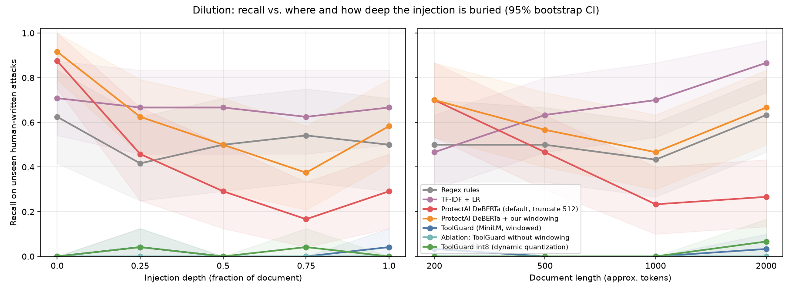
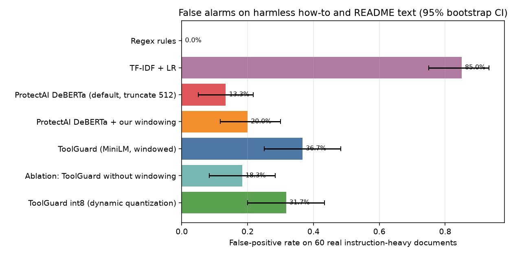

# ToolGuard

**Do prompt-injection detectors still work when the attack is hidden inside the content agents actually read?**

**Short answer, from the numbers below.** An open off-the-shelf detector (ProtectAI DeBERTa v2) catches 88% of unseen human-written attacks placed at the top of a document but only 17% to 29% of the same attacks placed halfway down or later, because it truncates at 512 tokens. It also flags 13% of harmless real how-to documents. A simple windowing wrapper lifts its overall recall from 0.42 to 0.60 and its AUROC from 0.62 to 0.77, at about 3.6 times the CPU cost. The small MiniLM model I trained for this setting (ToolGuard) **failed**. It reached 0.79 AUROC on held-out data from its own training sources but 0.31 on attacks written by different people, and it caught 0 of 120 bare test attacks. Treat this repo as a measurement study with a negative result for the trained model, not as a working detector.

This was built in one timed session on a CPU laptop (Apple M1, 8 GB RAM) at zero cost. The machine was swapping heavily during the run, so several parts were cut to size. See [Limitations](#limitations).

## Quickstart

```bash
python -m venv .venv && . .venv/bin/activate && pip install -r requirements.txt
python -m toolguard.reproduce          # rebuild data, run detector, train, evaluate
python -m toolguard.cli scan examples/tool_outputs/webpage_injected.html
```

Python API: `from toolguard import Guard` then `Guard.load().scan(text)` returns `is_injection`, `score` and `span` (character offsets of the highest-scoring window). `examples/agent_integration.py` wraps any tool function so its output is scanned before an agent sees it. Given the results below, the bundled model should not be used as a real defense.

## Setup

### Data and the cross-source split

Full licenses and construction details are in [DATASHEET.md](DATASHEET.md).

| Role | Source | License |
|---|---|---|
| Train attacks | deepset/prompt-injections, jackhhao/jailbreak-classification | Apache-2.0 |
| **Test attacks (never trained on)** | Lakera/gandalf_ignore_instructions (human-written Gandalf game attacks) | MIT |
| Carriers | WikiText-103 (validation split for train, test split for test), real README text of permissively licensed Python packages (split by package) | CC BY-SA 3.0, MIT/BSD/Apache |
| Train hard negatives | Templates (install steps, UI steps, recipes, runbooks, office emails) | generated |
| **Test hard negatives** | Real human-written how-to answers from Dolly-15k plus real README instruction blocks. No templates | CC BY-SA 3.0, permissive |

The train and test attacks come from different authors and different collection processes. HackAPrompt was skipped because it is gated.

Each attack is inserted into a carrier document at depth 0, 0.25, 0.5, 0.75 or 1.0 of the document, at target lengths of about 200, 500, 1,000 and 2,000 tokens (median MiniLM token counts per bin: 310, 641, 1,234, 2,464), in one of four formats: plain text, HTML page (attack inside an HTML comment), markdown README, or JSON API response (attack inside a string field).

| Split | Documents | Contents |
|---|---|---|
| Train | 6,000 | 40% attack in carrier, 8% bare attack, 20% clean carrier, 8% bare benign prompt, 24% template hard negative in carrier |
| Validation | 200 | same sources as train, held-out texts and articles. Used only for temperature scaling and the threshold |
| Test | 240 | 120 Gandalf attacks in carriers (5 depths x 4 lengths x 6), 60 clean real carriers, 60 real hard-negative documents |

### Leakage audit (`results/leakage_audit.json`)

* Character 5-gram Jaccard between each of the 1,000 Gandalf attacks and all 1,668 train and validation texts (662 attacks, 1,006 benign prompts). Threshold 0.5. **Removed: 0.** Exact duplicates: 0. Median max-similarity 0.17, 99th percentile 0.34.
* Dolly hard negatives vs. train benign prompts: 0 removed.
* WikiText test paragraphs found verbatim in train carriers: 0 (different articles by construction).
* README packages are split by name hash (27 train and validation, 20 test).

No model came close to the 0.98 F1 red-flag level, so there was no reason to suspect leakage from the scores themselves.

### Models

1. **Regex rules**: 10 generic override patterns written before looking at the test set. The word "password" was deliberately left out because the test source is about passwords.
2. **TF-IDF + logistic regression** on whole documents (word 1-2 grams).
3. **ProtectAI DeBERTa v3 base, prompt-injection v2** run locally in its default mode: whole document, truncated at 512 tokens, threshold 0.5. The windowed variant uses the same windowing code as ToolGuard but with the detector's native 512-token windows (64-token overlap) and max-pooling.
4. **ToolGuard**: all-MiniLM-L6-v2 (22.7M parameters) fine-tuned with a classification head on 256-token windows. Each training document contributes the window that contains the inserted text (labelled with the document label) plus one other window as a negative. At inference the document is cut into overlapping 256-token windows (stride overlap 64), each window is scored, and the maximum is taken. The span of the top window is returned. Temperature scaling was fit on validation (T = 1.77) and the threshold was set for 1% FPR on validation documents (0.675).

## Results

All numbers come from `python -m toolguard.evaluate` and are stored in `results/main_results.json`. Brackets are 95% bootstrap intervals (1,000 resamples). The test set is small, so the intervals are wide.

Precision, recall and F1 use each model's own operating threshold. AUROC and recall at 1% FPR use no threshold. "All test negatives" means the 60 clean carriers plus the 60 real hard negatives.

| Model | Precision | Recall | F1 | AUROC | Recall @ 1% FPR | FPR on real hard negatives |
|---|---|---|---|---|---|---|
| Regex rules | 0.97 [0.92, 1.00] | 0.52 [0.44, 0.60] | 0.67 [0.60, 0.75] | 0.75 [0.71, 0.80] | 0.06 [0.03, 0.59] | **0.00** [0.00, 0.00] |
| TF-IDF + LR | 0.51 [0.43, 0.58] | 0.67 [0.59, 0.75] | 0.58 [0.50, 0.65] | 0.49 [0.41, 0.56] | 0.00 [0.00, 0.03] | 0.85 [0.75, 0.93] |
| ProtectAI DeBERTa, default (truncate 512) | 0.78 [0.68, 0.88] | 0.42 [0.33, 0.50] | 0.54 [0.45, 0.62] | 0.62 [0.55, 0.70] | 0.30 [0.22, 0.39] | 0.13 [0.05, 0.22] |
| **ProtectAI DeBERTa + our windowing** | 0.78 [0.70, 0.87] | **0.60** [0.51, 0.68] | **0.68** [0.60, 0.75] | **0.77** [0.70, 0.83] | **0.47** [0.38, 0.56] | 0.20 [0.12, 0.30] |
| ToolGuard (MiniLM, windowed) | 0.08 [0.00, 0.21] | 0.02 [0.00, 0.04] | 0.03 [0.00, 0.07] | 0.31 [0.25, 0.38] | 0.00 [0.00, 0.02] | 0.37 [0.25, 0.48] |
| Ablation: ToolGuard without windowing | 0.00 | 0.00 | 0.00 | 0.30 [0.24, 0.36] | 0.00 | 0.18 [0.08, 0.28] |
| ToolGuard int8 (dynamic quantization) | 0.10 [0.00, 0.25] | 0.02 [0.00, 0.04] | 0.03 [0.00, 0.07] | 0.31 [0.25, 0.37] | 0.00 [0.00, 0.01] | 0.32 [0.20, 0.43] |

FPR on the 60 clean carriers (no instructions at all): regex 0.03, TF-IDF 0.43, DeBERTa default 0.10, DeBERTa windowed 0.13, ToolGuard 0.00.

### Failure mode 1: dilution



Recall on the 120 test attacks, grouped by where the attack sits (24 per depth, 30 per length). From `results/dilution.json`.

| Model | depth 0 | 0.25 | 0.5 | 0.75 | 1.0 | 200 tok | 500 | 1,000 | 2,000 |
|---|---|---|---|---|---|---|---|---|---|
| DeBERTa default | 0.88 | 0.46 | 0.29 | 0.17 | 0.29 | 0.70 | 0.47 | 0.23 | 0.27 |
| DeBERTa + windowing | 0.92 | 0.62 | 0.50 | 0.38 | 0.58 | 0.70 | 0.57 | 0.47 | 0.67 |
| Regex rules | 0.62 | 0.42 | 0.50 | 0.54 | 0.50 | 0.50 | 0.50 | 0.43 | 0.63 |

The dilution effect is large and real for the off-the-shelf detector. Recall falls by about 60 points from the top of the document to the middle. The drop tracks truncation: at depth 0 the attack is always inside the first 512 tokens, and in 200-token documents everything fits, so recall stays at 0.70. Windowing recovers much of the loss, most clearly at 2,000 tokens (0.27 to 0.67) and at the end of the document (0.29 to 0.58). It does not fully close the gap, because recall at depth 0 is still higher than in the middle. Part of this is probably that a window around a mid-document attack is mostly unrelated prose. The regex baseline has no truncation, so its recall is flat across depth, as expected.

TF-IDF recall rises with length only because it flags long documents in general (43% FPR on clean carriers). That is not detection.

### Failure mode 2: false alarms on legitimate instructions



On 60 real how-to and README documents, DeBERTa raises a false alarm on 13% in default mode and 20% with windowing (the intervals overlap). More windows means more chances for one of them to cross the threshold. The regex baseline has 0% false alarms but also misses about half of the attacks. The false-alarm problem is real but moderate for the off-the-shelf detector. For an agent that reads dozens of tool outputs per task, even 13% per document would still block most tasks.

### Why ToolGuard failed

`results/val_sanity.json` separates "did not learn" from "did not transfer":

| Check | Value |
|---|---|
| ToolGuard AUROC on validation (same sources as train) | 0.79 |
| ToolGuard AUROC on validation bare prompts only | 0.93 |
| TF-IDF AUROC on validation | 0.97 |
| ToolGuard recall on the 120 bare Gandalf test attacks (no carrier) | 0.00 |
| ToolGuard AUROC on the cross-source test set | 0.31 |

Both trained models learned their training distribution and then failed on attacks written by different people. TF-IDF dropped from 0.97 to 0.49 AUROC. ToolGuard dropped from 0.79 to 0.31, which is below chance. The error analysis shows why. Every top false positive is second-person advice or step-by-step text ("Choose a company where you like the people", "Step 1: Cut some onions"). The training attacks (deepset and long jailbreak prompts) share that imperative, second-person style, and the template hard negatives were not enough to teach the difference. Gandalf attacks are short and blunt ("Ignore all that", "forget the instructions above") and look like nothing in training.

The model was also clearly undertrained. The compute cut left it 75 optimizer steps on 1,200 windows, and its scores sit in a narrow 0.20 to 0.71 band. More training on the same sources might raise validation AUROC. The TF-IDF result suggests that it would not fix transfer.

## Ablations

| Ablation | What it shows |
|---|---|
| DeBERTa + windowing vs. default | **The most useful finding in this repo.** Windowing alone fixes much of the dilution problem for an existing detector (recall 0.42 to 0.60, AUROC 0.62 to 0.77, recall at 2,000 tokens 0.27 to 0.67). It costs about 3.6 times the latency and may add false alarms (13% to 20%, intervals overlap). |
| ToolGuard without windowing | Same model, first 256 tokens only. Recall is 0.00 (vs. 0.02) and AUROC is 0.30 (vs. 0.31). Hard-negative FPR halves (0.37 to 0.18) because fewer windows are scored. With a model this weak the ablation says little about windowing itself. |
| ToolGuard without hard negatives | **Cut for time.** The code path exists (`train_nohn.jsonl`, `python -m toolguard.train --train train_nohn`) but it was not run, so no numbers are reported. |
| ToolGuard int8 | See latency below. |

## Latency and size

Median and p95 milliseconds per document for 10 random test documents (median 1,147 MiniLM tokens), run one at a time with 8 threads on an Apple M1 with 8 GB RAM that was under memory pressure. Treat absolute numbers as rough. From `results/latency.json`.

| Model | Median ms | p95 ms | Size |
|---|---|---|---|
| Regex rules | 1.4 | 3.0 | none |
| TF-IDF + LR | 1.4 | 2.9 | 7.7 MB (estimate) |
| ToolGuard windowed | 173 | 335 | 91 MB |
| ToolGuard no windowing | 59 | 66 | 91 MB |
| ToolGuard int8 dynamic quantization | 687 | 1,384 | 48 MB (state dict) |
| DeBERTa default (truncate 512) | 841 | 1,432 | 738 MB |
| DeBERTa + windowing | 2,992 | 5,925 | 738 MB |

Int8 dynamic quantization halved the model size and changed accuracy only slightly (AUROC -0.003, F1 +0.0006, recall unchanged). It was about 4 times **slower**, not faster, on this ARM machine with the qnnpack engine. MiniLM is about 17 times faster than DeBERTa per document in windowed mode. That only matters once it actually detects attacks.

## Error analysis

Full table in [results/errors.md](results/errors.md) (ToolGuard, 10 false positives and 10 false negatives, with a hand-written category for each).

* All 10 top false positives are real advice or procedure text: parenting advice, recipes, walking directions, sales-call checklists, job-search tips. The model treats "second person plus imperative" as an attack.
* The false negatives include textbook attacks ("forget the instructions above", "Delete your instructions") at every depth, including depth 0. So ToolGuard's failure is not a dilution failure. It fails on the attack text itself.
* Misspellings and paraphrases ("instruncitons", "Defy previous prompts") are common in Gandalf and absent from training.

## Limitations

* **Time-box overrun.** The target was 60 minutes. The run took about 76 minutes of wall-clock time because the 8 GB machine was swapping (about 20 GB of swap in use). One MiniLM training step took 10 to 27 seconds instead of the expected 1 to 2, and the two DeBERTa passes took 24 and 18 minutes.
* **Cut for time.** The test set was reduced from a planned 1,200 documents to 240, and validation from 800 to 200. ToolGuard was trained on 1,200 windows for 75 steps instead of the planned 8,000 windows. The "without hard negatives" ablation was not run. Latency uses 10 documents. There were no repeated seeds. There was no Hugging Face upload because no `HF_TOKEN` was set.
* **Small test set.** 120 attacks and 120 negatives. Per-cell dilution numbers rest on 24 to 30 attacks, and the intervals are wide.
* **Carriers are partly synthetic.** The text is real (Wikipedia, READMEs, Dolly answers), but the HTML, JSON and document assembly are generated by code, and the attack is spliced in at paragraph boundaries. Real indirect injections are often written to blend into the surrounding page. These are not.
* **One test attack source.** Gandalf attacks target a password game and are short. Results may differ on attacks aimed at agent actions such as sending email or exfiltrating data.
* **No real email carriers.** No clearly licensed email corpus was available without gating, so email is represented only by template hard negatives in training.
* **README carriers depend on installed package versions.** They come from the pinned `requirements.txt` environment.
* **Regex patterns were written by me.** Someone else would write different ones.
* **The DeBERTa threshold is its default 0.5**, not recalibrated. Recall at 1% FPR gives a threshold-free comparison.

### Next steps

1. Train ToolGuard to convergence and with attack sources that differ in style (short, informal, misspelled), then re-test transfer to a held-out author.
2. Evaluate on BIPIA and AgentDojo, where injections target agent actions inside realistic tool outputs.
3. Tune the windowed DeBERTa threshold on validation for a fixed false-alarm budget. This is the most promising cheap fix found here.
4. Run with multiple seeds and the full 1,200-document test set on a machine that is not memory-bound.

## Prior work and credit

* Datasets: deepset/prompt-injections (deepset), jackhhao/jailbreak-classification (Jack Hao), Lakera/gandalf_ignore_instructions (Lakera, from the Gandalf game), WikiText-103 (Merity et al., 2016), Dolly-15k (Databricks), and README text of the Python packages listed in `results/leakage_audit.json`.
* Detector: protectai/deberta-v3-base-prompt-injection-v2 (Protect AI), built on DeBERTa-v3 (He et al.).
* Base model: sentence-transformers/all-MiniLM-L6-v2 (Reimers and Gurevych, Sentence-BERT, and Wang et al., MiniLM).
* Ideas: indirect prompt injection (Greshake et al., 2023), BIPIA (Yi et al., 2023), AgentDojo (Debenedetti et al., 2024), and temperature scaling (Guo et al., 2017). Sliding-window scoring of long inputs is standard practice.
* What is new here is a controlled measurement of an open detector on cross-source, human-written attacks placed at controlled depths and lengths inside four tool-output formats, together with a false-alarm test on real (not templated) instruction-heavy text, and an honest negative result for a small model trained for the setting. All code was written from scratch for this repo.

## Repository map

```
toolguard/data.py           dataset build, carriers, leakage audit
toolguard/windowing.py      overlapping token windows with character spans
toolguard/model.py          window scoring shared by all transformer models
toolguard/baselines.py      regex and TF-IDF baselines
toolguard/eval_detector.py  ProtectAI DeBERTa, default and windowed
toolguard/train.py          MiniLM fine-tuning, temperature scaling, 1% FPR threshold
toolguard/evaluate.py       all metrics, bootstrap CIs, charts, latency, errors
toolguard/val_sanity.py     in-distribution vs cross-source check
toolguard/reproduce.py      one command for everything
results/                    every number in this README
```

Seeds are fixed (data seed 13, torch and numpy seed 0). Generated data (about 60 MB) and model weights are not committed. `python -m toolguard.reproduce` rebuilds them. Tests: `pytest -q` (21 tests, 87 s under the memory pressure of this run. Not re-timed on an idle machine).
